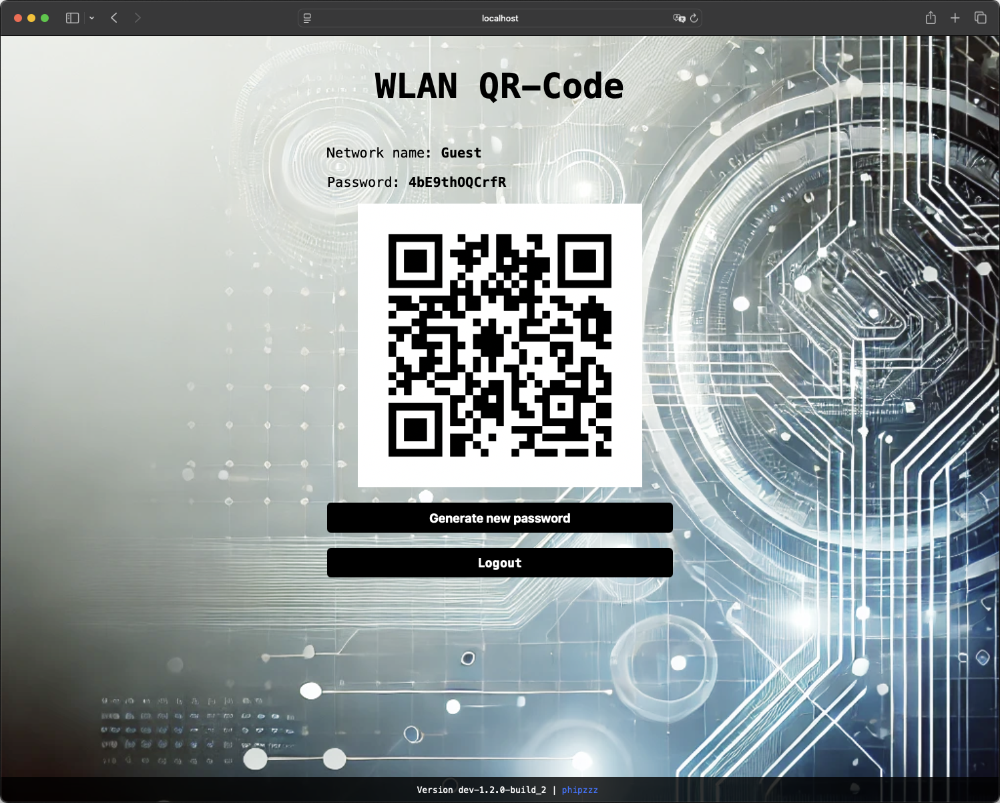

# fritzbox-wlan-password-rotator

## What is it

The fritzbox-wlan-password-rotator is a simple tool which automatically updates your FRITZ!Box guest WLAN password after a set period and displays updated credentials and QR code on a centralized web page (in your home network).

## Features

-   Automatic re-creation of your guest WLAN password
-   Password protected web ui to easily access WLAN credentials
-   Dynamic QR code generation for guest WLAN credentials
-   Trigger manual guest WLAN password renew
-   Public page with network credentials for offices or public places e.g. cafes (can be enabled/disabled)
-   Automatic data fetching if the guest WLAN credentials were changed directly on your FRITZ!Box (or somewhere else)
-   Show a custom welcome message (on public page)
-   Show a custom background image



Further screenshots can be found [here](./images/).

## Why

Have you ever wondered who all knows the access data for your guest WLAN? If you are one of the lucky ones who have enterprise network technology (e.g. with RADIUS authentication), you may not care. But what if this is only due in the next expansion stage of your homelab? Or you already have enterprise network technology, but not in the guest network. Do you want everyone who has ever had access to be able to keep it indefinitely, or even share it with others?

Sure, you can renew your password manually in intervals. But let's be honest. It's easy to get lost in the stress of everyday life. You also have to print out new QR codes or access data. After all, you don't want to have to check the web interface of your FRITZ!Box for the password for every guest.

The fritzbox-wlan-password-rotator does this work for you and offers you a simple web interface in which you get an overview of the current access data of your FRITZ!Box guest WLAN. This will of course be updated the next time you update your password. If you can't wait that long, you can create a new random password at any time.

All you need is some kind of server that is always accessible. If you have a NAS - perfect. But a Raspberry Pi will also do.

## How it works

The fritzbox-wlan-password-rotator is deployed in your private network. From there, the application will alter your guest WLAN password automatically.

The application basically consists of four parts:

-   Webserver - display the credentials or trigger manual password renewals
-   Password generator - creating random passwords according to your specifications
-   Communication interface to your FRITZ!Box (done via [fritzconnection](https://github.com/kbr/fritzconnection))
-   Scheduler - run jobs like password renewals or fetching credentials automatically

## Deploy the image

### Prerequisites

-   Using a compatible FRITZ!Box for WLAN (or at least for the WLAN you want to update regularly)
-   Admin access to your FRITZ!Box
-   Having some kind of Server/NAS/Raspberry Pi running 24/7
-   Having Docker installed and running
-   **optional** _- Creating a dedicated FRITZ!Box user (technically, every admin account works, but I recommend using a dedicated one). See https://en.avm.de/service/knowledge-base/dok/FRITZ-Box-4020/1522_Accessing-FRITZ-Box-from-the-home-network-with-user-accounts/ for further details and grant "FRITZ!Box settings" privileges._

### Configure

Configuration is done via [.env](./.env)-file. You can also find the description of the parameters there.

### Chose method to run

There are many different ways to run the application. I personally recommend using docker compose, but it depends on your experience and setup.

#### docker run

You will need at least the environment variables named below. Further can be found in [.env](./.env).

```bash
docker run \
    -p 5000:5000 \
    -e CRONTAB_EXPRESSION="0 3 * * *" \
    -e FB_ADDRESS="192.168.178.1" \
    -e FB_USER="user" \
    -e FB_PASSWORD="secret-password" \
    -e WLAN_CONFIGURATION="WLANConfiguration3" \
    -e WEB_PASSWORD="password" \
    -e TZ="Europe/Berlin" \
    --detach \
    --restart=always \
    --name fb-pw-rotator \
    phipzzz/fritzbox-wlan-password-rotator:latest
```

#### docker compose (Recommended)

Copy the [docker-compose.yml](./docker-compose.yml) and [.env](./.env) to your project directory. Update the .env-file according to your personal needs.

```bash
services:
    fb-pw-rotator:
        image: "phipzzz/fritzbox-wlan-password-rotator:latest"
        ports:
            - "5000:5000"
        restart: always
        env_file:
            - ./.env
```

```bash
docker compose up -d
```

#### Build docker image from source

```bash
git clone https://github.com/phipzzz/fritzbox-wlan-password-rotator.git
cd fritzbox-wlan-password-rotator
git tag
git checkout # <tag you want to build>
docker build -t fritzbox-wlan-password-rotator:<your tag> .
```

Afterwards, choose method to run.

#### Python (Without Docker)

It is also possible to run the application without Docker, but this requires manual adaptions and thus is only recommend for advances users.

## Supported FRITZ!Boxes

Following FRITZ!Boxes were tested successfully. Feel free to add further ones. I guess almost all current models will work but they haven't been tested so far.

-   **FRITZ!Box 7590 AX**

    -   FRITZ!OS 8.00

-   **FRITZ!Box 7530**

    -   FRITZ!OS 8.00

-   **FRITZ!Box 7490**
    -   FRITZ!OS 7.59
    -   FRITZ!OS 7.57

## Disclaimer

### Liability

The software is provided "as is", without warranty of any kind, express or implied, including but not limited to the warranties of merchantability, fitness for a particular purpose and noninfringement. In no event shall the authors or copyright holders be liable for any claim, damages or other liability, whether in an action of contract, tort or otherwise, arising from, out of or in connection with the software or the use or other dealings in the software.

### Unaffiliated with AVM and Trademarks Notice

fritzbox-wlan-password-rotator is neither related nor supported by AVM. Also AVM reserves the right to add, modify or remove features of their products at any time without notice. Furthermore the terms “AVM”, "FRITZ!Box", “Fritz!Box” and “Fritz!OS” are trademarks of AVM Computersysteme Vertriebs GmbH.
